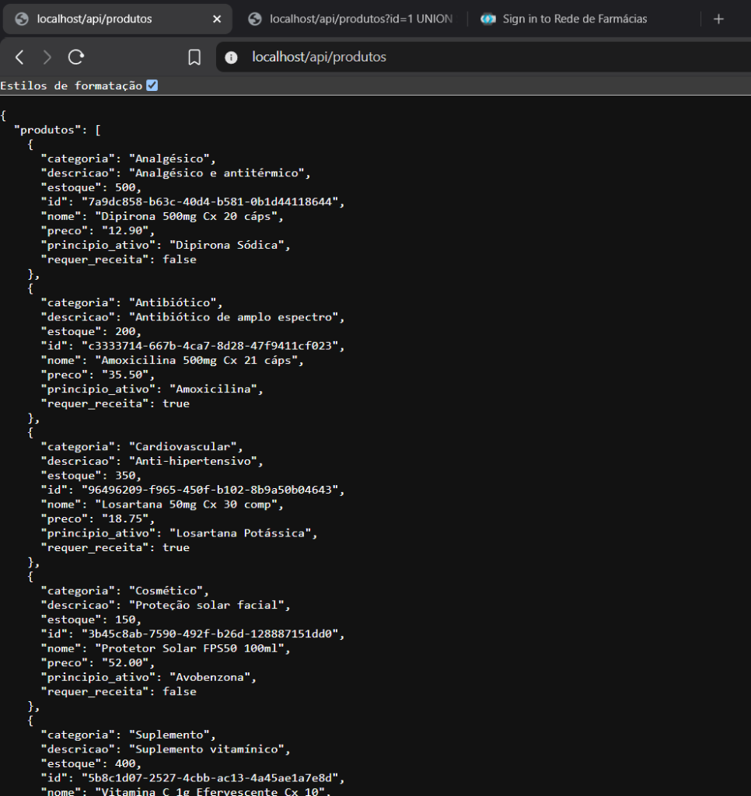
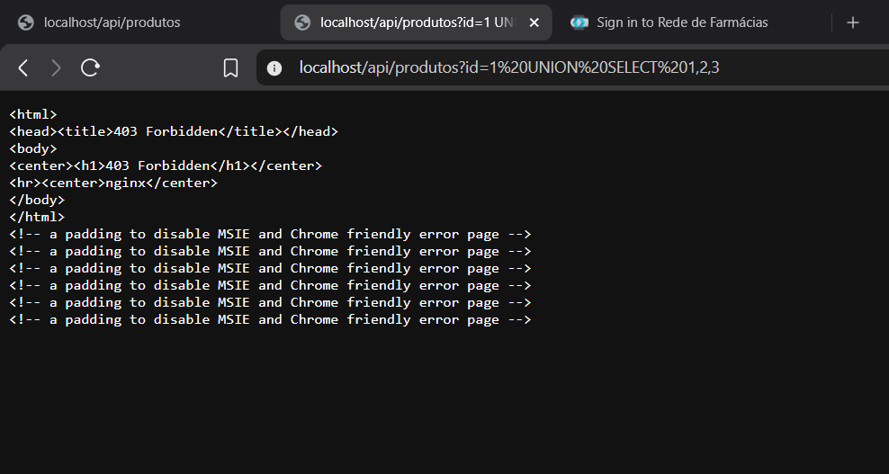
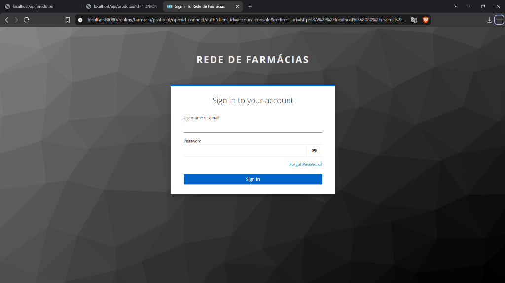

# RELATÓRIO DE SPRINT E ACOMPANHAMENTO DIÁRIO (DAILY)
## Projeto: Arquitetura Segura e Testes de Invasão/Defesa — Rede de Farmácias
**Curso / Disciplina:** Experiência Criativa — Segurança da Informação  
**Instituição:** Pontifícia Universidade Católica do Paraná (PUCPR)  
**Data dos Trabalhos:** Setembro de 2026  

---

## 1. Identificação da Equipe
*   **Gustavo Toshio Kawano** (Presente e atuante)
*   **Henrique Papai** (Presente e atuante)
*   **Edson Renato** (Presente e atuante)

---

## 2. Configuração Obrigatória de Usuários (Menor Privilégio)
Conforme exigência do projeto acadêmico, os usuários padrão foram configurados no ambiente com privilégios estritamente mínimos (*least privilege*):
*   **Usuário de Sistema (OS / PostgreSQL / Docker):** `teste` | **Senha:** `T35t3`  
    *Privilégio:* Role no PostgreSQL com acesso apenas de consulta (`SELECT`) a tabelas públicas e view anonimizada; usuário não-root no container.
*   **Usuário para Aplicações (Keycloak IAM / Portal Web):** `teste@pucparana.com` | **Senha:** `Teste@2026`  
    *Privilégio:* Papel restrito de `cliente` no Keycloak, sem acessos administrativos ou de farmacêutico.

---

## 3. Backlog do Projeto
*   Segmentação de redes Docker (DMZ 172.20.0.0/24 e Interna 172.21.0.0/24).
*   WAF ModSecurity com OWASP CRS e regras DLP contra vazamento de CPF e cartões.
*   IDS/IPS Suricata com 11 regras alinhadas às táticas do MITRE ATT&CK.
*   Aplicação e-commerce (Flask), PostgreSQL com view LGPD e Keycloak (MFA).
*   SIEM Wazuh completo (Manager, Indexer OpenSearch, Dashboard e Agentes).
*   Pipeline de anonimização LGPD com $k$-anonimato ($k \ge 1$).
*   Migração para 2 VMs Linux com pfSense e automação dos 4 cenários de teste.

---

## 4. Atividades Realizadas
*   **Infraestrutura:** Implementação das composições `docker-compose.dmz.yml` e `docker-compose.internal.yml` com 10 containers integrados e operacionais.
*   **Defesa de Borda:** ModSecurity ativo na porta 80 bloqueando SQL Injection (`403`) e ferramentas maliciosas; regras DLP ativas contra exposição de CPF.
*   **Detecção:** Suricata monitorando tráfego lateral e exfiltração em tempo real.
*   **Identidade e Banco:** Keycloak com realm e MFA importados; PostgreSQL estruturado com dados sintéticos e view anonimizada.
*   **SIEM:** Cluster Wazuh Indexer inicializado (`GREEN`), Dashboard ativo na porta 5601 e agentes DMZ/Interno registrados.

---

## 5. Atividades em Desenvolvimento
*   Transferência dos serviços para as duas VMs Linux dedicadas integradas com o firewall pfSense de laboratório.
*   Ajuste da interface de rede de captura do Suricata na VM Linux.
*   Elaboração dos scripts executáveis (`.sh`) para demonstrar os 4 cenários do relatório.

---

## 6. Principais Dificuldades
*   **Permissões em Volumes Somente Leitura (`:ro`):** Incompatibilidade de escrita em scripts de inicialização do NGINX/Suricata, resolvida injetando as regras no diretório pós-CRS.
*   **Hardening no Docker Desktop:** Diretiva `cap_drop: ALL` impedia a inicialização do PostgreSQL e Wazuh Agent; solucionada com privilégios mínimos operacionais e isolamento de rede.
*   **Inicialização do OpenSearch:** O Wazuh Indexer subiu desconfigurado; resolvido executando a rotina do `securityadmin.sh` com certificados TLS internos.

---

## 7. Evidências de Execução — Screenshots dos Momentos Críticos

### Momento 1: Teste Funcional do Web Server e Banco de Dados
*   **Atividade Trello correspondente:** `Segmentação de Redes Docker / PostgreSQL + View Anonimizada LGPD` (Coluna: Concluído)
*   **Imagem:**  
    
*   **Descrição do que está sendo feito:** Validação funcional da comunicação entre a DMZ e a Rede Interna. O Web Server de e-commerce recebe a requisição no endpoint `http://localhost/api/produtos` através do proxy reverso NGINX/WAF e retorna em formato JSON o catálogo de medicamentos consultado no PostgreSQL com usuário de menor privilégio.

---

### Momento 2: Teste de Segurança da Camada Perimetral (WAF ModSecurity)
*   **Atividade Trello correspondente:** `WAF ModSecurity + OWASP CRS + DLP` (Coluna: Concluído)
*   **Imagem:**  
    
*   **Descrição do que está sendo feito:** Teste de segurança ofensiva/defensiva. Disparo de requisição maliciosa simulando SQL Injection (`UNION SELECT`) via parâmetro GET. O ModSecurity com OWASP CRS na DMZ intercepta o padrão malicioso e rejeita imediatamente a conexão com status `HTTP 403 Forbidden` antes de qualquer contato com o backend.

---

### Momento 3: Gestão de Identidade e Acesso (Keycloak IAM e Usuário Obrigatório)
*   **Atividade Trello correspondente:** `Keycloak IAM com MFA (TOTP) / Configuração de Usuários de Menor Privilégio` (Coluna: Concluído)
*   **Imagem:**  
    
*   **Descrição do que está sendo feito:** Configuração do Provedor de Identidade (IAM). A interface de login do Realm `farmacia` gerencia o acesso seguro e o segundo fator (TOTP). Nela está cadastrado e validado o usuário de menor privilégio obrigatório `teste@pucparana.com` com a role restrita de `cliente`.
